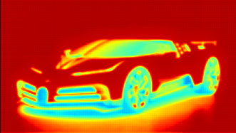

# Visualizing-Unet

A simple project to visualize kernels and features of a trained U-Net model

The unet implementation was done by : https://github.com/milesial/Pytorch-UNet

Here, we feed a sample image : 

And get multiple feature maps, like :

